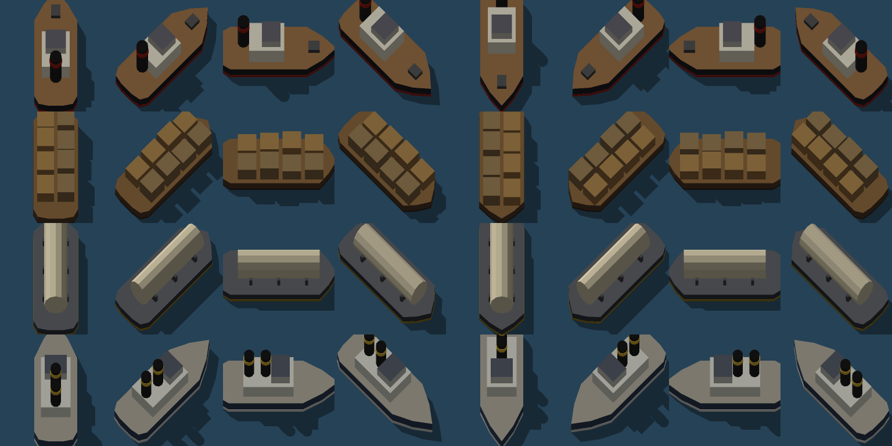

# Second Dawn

Мод-переделка для Factorio 2.0 (без Space Age) по мотивам Dr. Stone. Человечество окаменело. Игрок
просыпается статуей и заново проходит путь от камня до ракеты на Луну, а волны окаменения приходят всё чаще.

Версия 0.10: весь сценарий — пять эпох от камня до Луны, волны до победы или поражения, руины с записками,
звери и фермы, климат, материки, корабли. Дизайн целиком — [docs/DESIGN.md](docs/DESIGN.md).

## Механики

**Каменный век.** Ванильного дерева технологий, стартового набора, места крушения и кусак нет. Руками
добываются только мягкие породы: камень, глина, ракушечник, селитра. Железо, медь и уголь видны на карте,
но их добыча придёт в следующих эпохах. Деревья дают дерево и волокно, красные деревья — ещё и плоды.

**Топливо.** Костёр, стол учёного, копатель и рычаги горят на чём угодно. Печь для обжига, перегонный куб
и камера пробуждения — только на древесном угле, его делает костёр или печь из дерева.

**Исследования** идут на глиняных табличках (глина + уголь) в столе учёного. 8 технологий, 185 табличек.

**Волны окаменения.** Первая через 2 часа, затем через 4 часа, и каждый следующий интервал в 0.92 раза
короче. Волна превращает всех игроков в статуи. Статуя стоит на месте, игрок наблюдает, завод работает.

**Камера пробуждения** — одна на команду. За 10 минут делает заряд в закрытый резервуар: вынуть или
накопить его нельзя, с зарядом внутри камера стоит. Если при волне заряд есть, он тратится и все сразу
оживают. Если нет — статуи оттаивают сами (волны 1–2: 5 мин, волна 3: 15 мин) или как только камера
доделает заряд. Завод должен сам привезти камере сырьё — это и есть цель.

**Эпоха 2 «Ремесло».** Кайловый копатель берёт твёрдую породу: медь, уголь и олово. Олова у лагеря нет,
ближайшее месторождение — в 150–250 клетках. Горн плавит медь и олово и сплавляет бронзу, жернова мелют
камень в песок, из дерева получается зола, из неё поташ. Стекловарня варит стекло из песка, поташа и
извести. Вторая наука — стеклянная колба (стекло + бронза). Каменный уголь горит в печах, как древесный.

**Заряд II** (ректификат и крепкая кислота в стеклянных бутылях, бутыли возвращаются) нужен с волны 4.
Заряд I против неё не работает. Если переключить камеру на заряд II, старый заряд сливается.

**Дикие звери.** Волки, кабаны и медведи живут в логовах от 150 клеток (медведи — дальше 500). Кто
подойдёт к логову ближе 25 клеток, на того нападут. Волки и медведи иногда ночью ходят в набег на
постройки (не раньше первой волны), кабаны только защищаются. Волна окаменения каменит зверей на 10 минут.
Охота: праща, лук, частокол, самострел на стрелах. Со зверей — мясо (жареное лечит), шкуры (кожа: куртка,
самострел) и кости (мука: огород даёт вдвое больше).

**Эпоха 3 «Пар и ток».** Сначала кричное железо в горне, потом домна (железо и сталь). Трубы, водяной
насос, котёл и паровая машина, медный провод и столбы. Электробуры, манипуляторы, сборщики и лаборатория.
Третья наука — механизм. Электрическая камера пробуждения ставится поверх старой и делает заряд III
(нужен с волны 7).

**Одомашнивание.** Ловчая сеть, брошенная в логово, ловит его, если зверей рядом нет (перебиты, ушли
в набег или окаменели от волны). На месте логова появляется ферма: свинарник, псарня или медвежий загон.
Фермы превращают корм или мясо в мясо, шкуры и кости. Рецепта у ферм нет: сколько поймали, столько и есть.

**Климат.** Севернее −1200 клеток холодно (снег, вольфрам, медведи), южнее +1200 жарко (дюны, сера, нефть,
кабаны). В холоде печи, сборщики, буры, лаборатории и котлы стоят, если рядом нет горящей жаровни
(эпоха 1) или радиатора на паре (эпоха 3). В жаре они работают половину времени без водяного охладителя
(эпоха 3). Игроку в холоде нужна шуба, в жаре — лёгкая накидка, иначе 2 HP/с. Ширина умеренного
пояса — настройка карты.

**Материки.** Игра начинается на умеренном материке шириной около 1600 клеток. Холодный север и жаркий
юг — за ~700 клетками глубокого океана. Вдоль берегов шельф — мелководье 45–80 клеток. Обычная засыпка
кладётся только на мелкую воду, глубинная (камень, сталь, раствор) — на глубокую: дорога через океан
возможна, но дорога. Настройка «Материки» (по умолчанию вкл.).


**Корабли.** Фарватер прокладывается как рельсы, но только по воде. Паровой буксир тянет баржи и
наливные баржи, причалы — станции, буи — сигналы: расписания и манипуляторы работают как у поездов.
Причал ставят у берега, выровненного засыпкой шельфа. В буксире можно плыть самому. Брикеты
(уголь + смола) дают +15% скорости, тормоза I–II сокращают рейс.



**Эпоха 4 «Химия и море».** С юга — сера (серная кислота), нефть (переработка, крекинг, нефтяное топливо)
и каучук с плантаций, которые растут только в жарком поясе. С севера — вольфрам для электропечи. Четвёртая
наука — реактив, пятая — морская карта: ни одну не сделать на одном материке. Заряд IV (эфир и вольфрамовые
электроды) нужен с волны 11. Винтовой пароход в полтора раза быстрее буксира: 27 клеток/с против 18.

**Эпоха 5 «Ракета» и финал.** Пластмасса, электроника, радар, шестая наука — приборная плата. Ракета из
30 частей. Игроки в скафандрах, стоящие у шахты при старте, летят на Луну: воздуха 5 минут и по 2 на каждый
кислородный баллон. Излучатель — источник окаменения — в 250–350 клетках от посадки; раз в 45 секунд
он каменит всех в 100 клетках на 8 секунд. Разберите его — и волн больше не будет. Если же волна застанет
команду всё ещё камнем — это поражение.

**Руины и записки.** Примерно на каждом десятом участке карты — руина с запиской, две руины есть у старта.
Записку достаточно подобрать — её прочитает вся команда. Бывают подсказки, альтернативные рецепты
(другим способом их не открыть) и клады: сундук с припасами, отмеченный на карте. Все прочитанные
записки — в дневнике (J).

**Настройки** (карта → настройки модов): частота волн (спокойно ×1.5 / нормально / жёстко ×0.7 / выкл);
звери (мирные / спокойные / обычные / опасные); новые игроки начинают статуями (3 минуты).

## Сборка и тесты

```bash
./build.sh                                   # dist/2.0/second-dawn_<version>.zip
tests/run.sh                                 # синтаксис, локали, модель баланса
tests/run-scenario.sh tree 10                # дерево технологий на настоящих прототипах, мир
tests/run-scenario.sh chain 73100            # все здания и три волны
tests/run-scenario.sh chain2 55800           # все здания эпохи 2, правила заряда II
tests/run-scenario.sh notes 10               # руины, записки, клады
tests/run-scenario.sh wildlife 44700         # логова, набег, самострел, добыча, заморозка
tests/run-scenario.sh chain3 72400           # электросеть, домна, лаборатория, электрическая камера, заряд III
tests/run-scenario.sh capture 5700           # поимка логова, фермы
tests/run-scenario.sh climate 20300          # пояса, замерзание, перегрев, одежда
tests/run-scenario.sh sea 5                  # материки, шельф по 32 лучам, засыпка
tests/run-scenario.sh ships 9100             # фарватер, рейсы по расписанию, погрузка, брикеты
tests/run-scenario.sh chain4 90400           # химия, нефть, каучук, вольфрам, заряд IV
tests/run-scenario.sh chain5 111000          # ракета, Луна, воздух, пульс, победа
tests/run-scenario.sh defeat 110             # поражение
tools/map-preview.sh 7 777                   # превью карты 7168×7168 в docs/img
SD_BENCH_VERBOSE=1 tests/run-scenario.sh ups-wild 6000 && python3 tests/ups-report.py "$SD_TEST_DIR/bench.log" 4000
SD_BENCH_VERBOSE=1 tests/run-scenario.sh ups 3700 && python3 tests/ups-report.py "$SD_TEST_DIR/bench.log"
tests/run-heavy.sh desync 240                # heavy mode на сервере: нет рассинхрона
tests/run-all.sh                             # всё сразу
```

Сценарные тесты запускают отдельный безграфический экземпляр Factorio со своей папкой (`SD_TEST_DIR`,
по умолчанию `/tmp/sd-test`) и не трогают папку модов игрока.

`tools/render_ships.py` — рендер спрайтов кораблей (низкополигональные модели, свой растеризатор, 64 направления
с тенью, чистый Python); `tools/ship_contact_sheet.py` — картинка всех судов для README.

`tools/balance.py [эпоха]` — модель баланса: потоки, число машин, объём исследований и проверка дерева на тупики.
