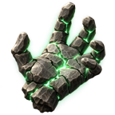
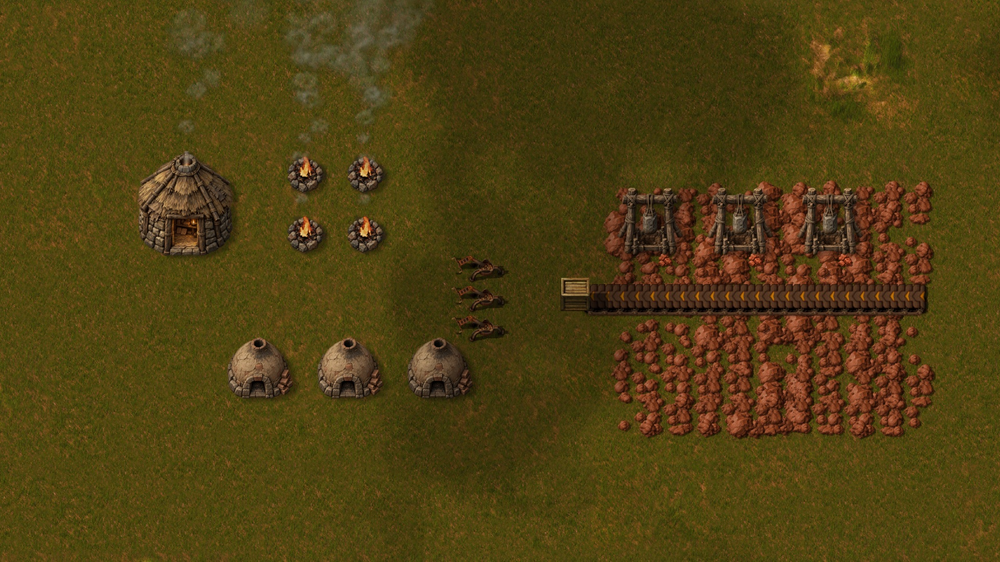
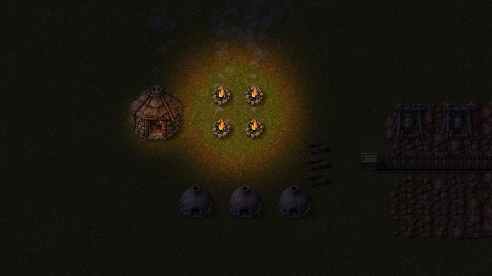
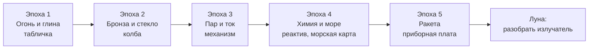
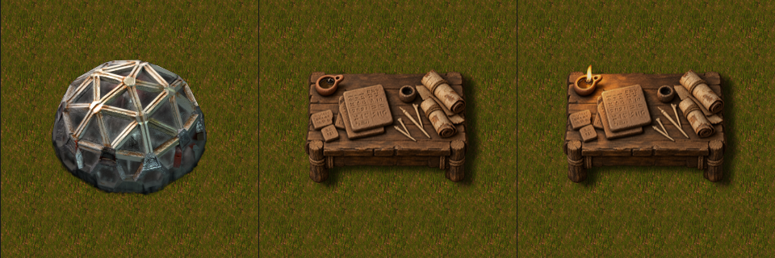
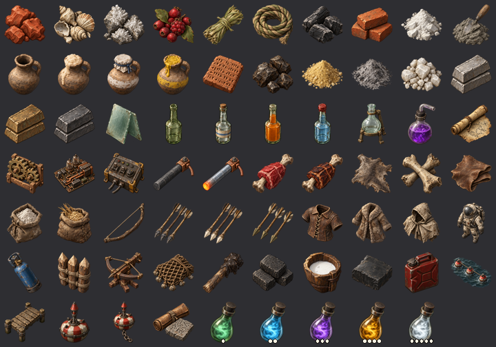

# Second Dawn



Мод-переделка для Factorio 2.0 (без Space Age) по мотивам Dr. Stone. Человечество окаменело. Игрок
просыпается статуей и заново проходит путь от камня до ракеты на Луну, а волны окаменения приходят всё чаще.

> **Сделано с помощью ИИ.** Код, баланс, тексты, тесты и часть графики созданы нейросетями: Claude
> (Anthropic) в Claude Code, картинки — ChatGPT, а также собственными скриптами проекта.
> Человек задавал идею, принимал решения и играл. Дизайн целиком — [docs/DESIGN.md](docs/DESIGN.md).

**Публичная бета, идёт тестирование.** Первые эпохи немного похожи на ферму (глина, дерево, огород) — это
каменный век; с бронзы и пара начинается привычный завод. Текст для портала модов — [docs/PORTAL.md](docs/PORTAL.md).

Весь сценарий из пяти эпох, волны до победы или поражения, звери со стаями, климат,
материки, корабли и Луна.





## Путь



Каждой эпохе соответствует свой заряд камеры пробуждения (I–V). Волны окаменения учащаются, и более
поздние волны требуют более сильного заряда.

## Механики

**Старт.** Ванильного дерева технологий, стартового набора, места крушения и кусак нет. Руками добываются
только мягкие породы: камень, глина, ракушки, селитра. Руки на 50% быстрее ванильных. С самого начала,
без исследований, доступны:
- лук с каменными стрелами;
- костёр, который сам выбирает рецепт: дерево → уголь, глина → кирпич, мясо → жаркое;
- копатель вдвое быстрее руки, чтобы глину не копать вручную;
- стол учёного.

Слева на экране — подсказка «Следующий шаг»: она ведёт до первого заряда пробуждения. Дневник (J)
хранит записи и прочитанные записки.

**Исследования** идут на глиняных табличках (1 глина + 1 уголь → 2) в столе учёного. В описании каждой
технологии написано, что и где нужно для изучения. Вся наука вынесена в отдельную вкладку «Наука».
«Гончарство» открывает лесную делянку: дерево растёт само, без рубки.

**Волны окаменения.** Первая через 2 часа, затем через 4 часа, и каждый следующий интервал в 0.92 раза
короче. Волна вспыхивает зелёным и превращает всех игроков в статуи. По краям экрана остаётся каменная
виньетка: завод работает, игрок наблюдает.

**Камера пробуждения** — одна на команду. Заряд делается в закрытый резервуар: вынуть или накопить его
нельзя. Если при волне заряд есть, он тратится, и команда сразу оживает. Если нет — статуи оттаивают
сами, но с каждой волной дольше. Если волна застанет команду всё ещё камнем — поражение.

**Эпоха 2 «Бронза и стекло».** Кайловый копатель берёт твёрдую породу: медь, уголь и олово. Олова у лагеря
нет, первая экспедиция — за 150–250 клеток. Горн плавит медь и олово и сплавляет бронзу, жернова мелют
песок, из золы вываривают поташ, стекловарня варит стекло. Вторая наука — стеклянная колба.

**Звери.** Волки, кабаны и медведи (в холоде) живут в логовах дальше 200 клеток от лагеря. В каждом
логове стая и примерно один вожак, крупнее и в несколько раз крепче:

| Логово | Обычные | Вожак |
|---|---|---|
| Волчье | волк, 40 HP | вожак стаи, 150 HP |
| Кабанье | кабан, 120 HP | старый секач, 350 HP |
| Берлога | медвежонок, 150 HP | медведь, 500 HP |

Как ведут себя звери:
- Кто подойдёт к логову ближе 25 клеток, на того нападут.
- Все звери медленнее бегущего персонажа и бросают погоню в 60 клетках от логова.
- Волки и медведи ходят ночью в набег на постройки, не раньше первой волны: стая громит край базы и идёт
  вглубь, через 4 минуты уходит.
- Убив игрока, звери уходят. Игрок возрождается с луком и стрелами.
- Лечит мясо (жареное в костре — втрое лучше), постройки чинит ремонтный набор; оба — со старта.
- Волна окаменения каменит зверей на 10 минут.

Ловчая сеть превращает логово в ферму: свинарник, псарню или медвежий загон.

**Оружие.**

| Эпоха | Что есть |
|---|---|
| Старт | лук, каменные стрелы |
| 1 | костяные стрелы, частокол |
| 2 | ручной арбалет, бронзовые стрелы, самострел-турель; порох без серы, мушкет, вертлюжная пушка |
| 3 | стальные болты, многозарядный самострел |
| 4 | порох с серой |

«Заточка наконечников» I–III: +20% урона стрелам за каждую ступень.

**Эпоха 3 «Пар и ток».** Кричное железо, домна, трубы, котёл, паровая машина, электросеть. Электробуры,
сборщики, лаборатория. Третья наука — механизм, электрическая камера делает заряд III.

**Климат.** Севернее −1200 клеток холодно (снег, вольфрам, медведи), южнее +1200 жарко (дюны, сера,
нефть). В холоде здания стоят без жаровни или радиатора, в жаре работают вполсилы без охладителя. Игроку
нужна шуба или лёгкая накидка.

**Материки.** Игра начинается на умеренном материке. Холодный север и жаркий юг — за ~700 клетками
глубокого океана, вдоль берегов шельф. Обычная засыпка — только на мелкую воду, глубинная — на глубокую.


**Корабли.** Фарватер прокладывается как рельсы, но по воде. Буксир тянет баржи, причалы — станции,
буи — сигналы: расписания и манипуляторы работают как у поездов.


**Эпоха 4 «Химия и море».** Сера, нефть и каучук с юга, вольфрам с севера. Четвёртая наука — реактив,
пятая — морская карта: ни одну не сделать на одном материке. Винтовой пароход быстрее буксира.

**Эпоха 5 «Ракета» и финал.** Пластмасса, электроника, радар, шестая наука — приборная плата. Ракета из
30 частей. Игроки в скафандрах у шахты летят на Луну: воздух ограничен, баллоны добавляют время.
Излучатель — источник окаменения — разобрать, и волн больше не будет.

**Руины и записки.** Примерно на каждом десятом участке карты — руина с запиской. Бывают подсказки,
альтернативные рецепты и клады. Записку читает вся команда.

**Настройки.** Частота волн, поведение зверей, новые игроки начинают статуями, ширина умеренного пояса,
материки, подсказка «Следующий шаг» (у каждого игрока своя).

**Мультиплеер** поддерживается: общая наука, общие записки, одна камера на команду. Heavy mode на
сервере проверен: рассинхрона нет.

## Графика

Здания и звери пока в основном перекрашенные ванильные. Своя графика заменяет их постепенно:
картинки из ChatGPT проходят через `tools/art.sh`, он вырезает фон, подгоняет цвет, делает тень и иконку.
Порядок работ и запросы — в [docs/ART.md](docs/ART.md) и [docs/PROMPTS.md](docs/PROMPTS.md).





## Сборка и тесты

```bash
./build.sh                                   # dist/2.0/second-dawn_<version>.zip
tests/run.sh                                 # синтаксис, локали, модель баланса
tests/run-scenario.sh chain 73100            # один сценарий в безграфическом экземпляре
tests/run-all.sh                             # всё: пути к картинкам, переводы, Факториопедия, сценарии, heavy mode
tools/art.sh sd-campfire 1.2 --ground 0.5    # картинка из art/incoming → в мод
tools/balance.py 2                           # модель баланса эпохи 2: потоки, машины, тупики в дереве
```

Тесты запускают отдельный безграфический экземпляр Factorio в своей папке (`SD_TEST_DIR`, по умолчанию
`/tmp/sd-test`) и не трогают игру игрока. Параллельные прогоны — только с разными `SD_TEST_DIR`.
Сценарии лежат в `tests/scenarios/`, их список — в `tests/run-all.sh`.

Как работать с проектом (для людей и ИИ-агентов) — [CLAUDE.md](CLAUDE.md).
