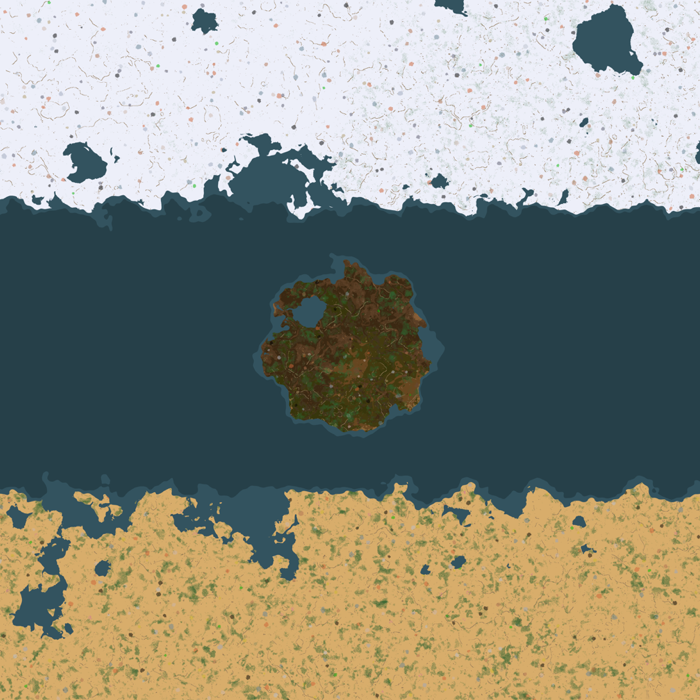

# Second Dawn — дизайн-документ v0.3

Статус: v0.6. Реализованы 0.1 (эпоха 1, §8), 0.2 «Записки» (§13), 0.3 «Ремесло» (§14), 0.4 «Звери» (§15)
0.5 «Пар и ток» (§16), 0.6 «Климат» (§17), 0.7 «Море» (§18) и 0.8 «Корабли» (§19).
Числа эпох 1–2 посчитаны `tools/balance.py` (он же проверяет дерево технологий на тупики); числа эпох 3–5 —
ориентиры, уточняются перед каждым этапом.

- Движок: Factorio 2.0.77, база 2.0, **без зависимости от Space Age**.
- Внутреннее имя мода `second-dawn` (свободно на мод-портале, проверено 2026-09-24), префикс прототипов `sd-`.
- Языки: русский и английский с первого релиза, остальные — в конце.
- Мультиплеер: кооператив 2–4 игрока, поддерживается с первого релиза.

---

## 1. Концепция

Мир по мотивам Dr. Stone, со своими названиями и персонажами. Тысячи лет назад волна с Луны окаменила
всё человечество. Природа поглотила города, от цивилизации остались руины. Игрок просыпается статуей,
которая треснула, и начинает с камня, глины и огня. Ванильная цель «запустить ракету» здесь — финал
сюжета: долететь до Луны и выключить источник окаменения.

Главное отличие от ванили: **волны окаменения повторяются и учащаются**. Завод должен научиться сам,
без игрока, производить заряд пробуждения. Иначе команда остаётся камнем навсегда.

### Столпы дизайна

1. **Наука с нуля.** Каждая эпоха повторяет реальную историю технологий: огонь → керамика → металл
   → пар → электричество → химия → ракета. Рецепты правдоподобны, но упрощены.
2. **Часы тикают.** Волны задают темп всему прохождению (§4), и давление растёт от эпохи к эпохе.
3. **Мир неоднороден.** Одна планета с климатическими поясами и океаном. Ресурсы разнесены
   по поясам, поэтому в игре нужны морская логистика, обогрев и охлаждение (§3).
4. **Масштабом не давим.** Сложность цепочек между Space Age и Krastorio 2, никаких
   десятков планет (что игроку не нравится в SE).

## 2. Эпохи и прогрессия

| Эпоха | Время* | Новое | Наука | Энергия | Заряд | Новые механики |
|---|---|---|---|---|---|---|
| 1. Камень | 0–2 ч | глина, известь, уголь, брожение, перегонка | Глиняная табличка | дерево, древесный уголь | I | волны, камера пробуждения |
| 2. Ремесло | 2–10 ч | медь, олово, бронза, стекло, зола и поташ, песок | Стеклянная колба | древесный и каменный уголь | II | руины и записки, звери и охота |
| 3. Пар и ток | 10–20 ч | железо, сталь, пар, электричество, ванильные машины в новом виде | Механизм | пар → электричество | III | одомашнивание, климат (обогрев) |
| 4. Химия и море | 20–32 ч | сера, кислоты, нефть, резина, корабли, порты, засыпка шельфа | Реактив + Морская карта | электричество | IV | морская логистика, дальние континенты, охлаждение |
| 5. Ракета | 32–45 ч | электроника, радио, ракетное топливо, скафандр | Космос | электричество, топливо | V | полёт на Луну, вылазка, финал |

\* Ожидаемое игровое время для игрока среднего темпа; жёсткий дедлайн — около 50 ч (§4).

Показанная в чате диаграмма «дерево прогрессии» соответствует этой таблице; при изменениях правим оба места.

## 3. Мир

### 3.1 Карта
- Стартовый континент среднего размера, вокруг него **шельф**: мелководье шириной 20–60 клеток.
- 2–3 дальних континента/острова в других климатических поясах, 300–1000 клеток по глубокой воде.
- Климат зависит от широты (координаты Y): полюса холодные, экватор жаркий, старт в умеренном поясе.
  Размеры задаются настройками карты.
- Руины прошлой цивилизации разбросаны по миру; в них лежат записки и клады.

### 3.2 Засыпка (эпоха 4)
- «Засыпка» кладётся только на мелководье, то есть на шельф. Сделано штатным ограничением
  `tile_condition` у landfill, без скриптов.
- «Глубинная засыпка» кладётся на глубокую воду и стоит в 10–20 раз дороже. Засыпать океан
  можно, но невыгодно.

### 3.3 Климат (эпохи 3–4)
Пояса: жаркий / умеренный / холодный. Пояс здания вычисляется один раз при постройке, не каждый тик.
- **Здания.** В холодном поясе машины без подогрева останавливаются. В жарком без охлаждения
  работают на 50% скорости.
- **Игрок.** Без тёплой или охлаждающей одежды (слот брони) персонаж медленно теряет здоровье.
- **Уникальные ресурсы.** Холодный пояс — редкий металл для ракеты (вольфрам).
  Жаркий пояс — сера и нефтяные выходы.
- Реализация скриптом: штатная заморозка движка (`entities_require_heating`) включается только
  для поверхности целиком.

### 3.4 Звери (эпохи 2–3)
Кусак нет. Вместо них «одичавшая фауна» — перекрашенные ванильные юниты.
- Звери территориальны: нападают, когда подходишь к логову. На загрязнение не реагируют.
  На базу приходят только ночью, в определённых поясах. Есть настройка агрессивности.
- С них падают шкура, кости и мясо: это источники кожи, костяной муки и еды.
- **Одомашнивание** (эпоха 3): логово захватывается приманкой и загоном и становится «фермой» —
  зданием, которое ест корм и производит шкуры, мясо и кости. Охота нужна только в начале.
- Волна окаменения каменит и зверей, и это окно для вылазки к логовам.

### 3.5 Записки (эпоха 2+)
Лежат в руинах и сундуках, генерируются вместе с участками карты. Прочитанная записка открывается
всей команде и даёт одно из трёх: скрытый рецепт, который иначе не найти; отметку клада на карте;
полезную подсказку. Все прочитанные записки собраны в дневнике по горячей клавише.

## 4. Волны окаменения

### 4.1 Правила
- Волна накрывает всех игроков на планете одновременно. Время до следующей волны всегда видно
  (маленький таймер, дневник).
- Окаменевший игрок — статуя на том же месте: не ходит, не строит, не крафтит, но видит карту.
  **Завод продолжает работать.**
- **Камера пробуждения** (одна на команду) производит заряд во внутренний резервуар без трубных
  соединений: вынуть заряд нельзя. Движок пускает в резервуар больше объёма (§7), поэтому
  ёмкость 1 держит скрипт: пока в резервуаре есть заряд, камера выключена (`disabled_by_script`).
  Начатый следующий крафт замирает и сохраняет прогресс и ингредиенты, накопить заряды нельзя.
  Волна забирает всё содержимое резервуара и включает камеру.
  Позднее исследование «Второй резервуар»: выключение при 2 зарядах, волна забирает 1.
- В момент волны: если в камере есть заряд нужного уровня, он тратится и все сразу оживают.
  Если нет, все остаются статуями, пока камера не доделает заряд. **Завод должен сам
  довезти сырьё и оживить вас.**
- Самооттаивание: волны 1–2 — 5 мин; дальше 15 мин, 30 мин, 1 ч, …; у последних волн — бесконечно.
- **Уровень волны** требует заряд не ниже своего уровня. Заряды старых уровней бесполезны,
  поэтому таймер задаёт темп всего дерева технологий.
- Порчи нет (решение игрока): заряд — как ракета в шахте, запас запрещён механически.
- Первые волны самооттаиванием, ручного вливания заряда нет.

### 4.2 Числа (сложность «Нормально»)
Первая волна через 2 ч. Первый интервал 4 ч, каждый следующий ×0.92.
Крафт заряда в камере: I — 10 мин, II — 15, III — 20, IV — 25, V — 30. Исследования ускоряют
камеру до ×3.

| Волна | Время | До следующей | Уровень |
|---|---|---|---|
| 1 | 2.0 ч | 4 ч | I (самооттаивание 5 мин) |
| 2 | 6.0 ч | 3.7 ч | I (5 мин) |
| 3 | 9.7 ч | 3.4 ч | I |
| 4 | 13.1 ч | 3.1 ч | **II** |
| 7 | 21.7 ч | 2.4 ч | **III** |
| 11 | 30.3 ч | 1.7 ч | **IV** |
| 15 | 36.4 ч | 1.2 ч | **V** |
| 26 | 45.8 ч | 30 мин | V — интервал короче базового крафта |
| 40 | 50.1 ч | 9 мин | V — короче крафта даже с ×3: **невозврат** |

Настройка сложности: Спокойно (все интервалы ×1.5) / Нормально / Жёстко (×0.7) / Выкл.

Интервалы сжимаются геометрически, поэтому около 50 ч есть абсолютная стена: к этому моменту
интервалы стремятся к нулю. Ускорение камеры отодвигает конец всего на несколько часов.
Основное давление создают уровни зарядов.

### 4.3 Мультиплеер
- Один заряд на волну на всю команду: число игроков не ломает баланс.
- Новый игрок (опция) появляется статуей и оживает через 3 минуты. Если команда в этот момент
  окаменела волной, он окаменевает вместе с ней.
- Игроки не в сети окаменевают или оживают, когда заходят снова.
- В начале новой игры первые игроки 4 секунды стоят статуями — сюжетное пробуждение.

## 5. Эпоха 1 «Камень» — вертикальный срез (релиз 0.1)

**Цель среза:** за ~1.5–2 ч от пробуждения построить камеру пробуждения и зарядить её до первой
волны. Первая волна проверяет результат. Волны 2 и 3 проверяют, что камера заряжается без игрока
(у волны 3 самооттаивание уже 15 минут); после волны 3 срез заканчивается сообщением
«продолжение следует».

В срезе нет зверей, климата, кораблей и записок: каждая большая механика выходит отдельным шагом.

### 5.1 Ресурсы
| Ресурс | Где | Добыча | Время добычи |
|---|---|---|---|
| Дерево | леса (ванильные деревья) | руками, 4 шт. с дерева + волокно 2 | ванильное |
| Плоды | плодовые деревья (часть ванильных видов, другой цвет листвы; гарантированы в стартовой зоне) и 5% с любого дерева | руками, 30% с плодового дерева; потом огород | — |
| Камень | ванильный | руками, копатель | 1 с |
| Глина | новые месторождения у воды | руками, копатель | 1 с |
| Ракушечник | новые месторождения на берегу | руками, копатель | 1 с |
| Селитра | новые месторождения (светлые пятна) | руками, копатель | 1.5 с |
| Железо, медь, уголь | ванильные, видны на карте | **нельзя** до эпохи 2 (отдельная категория добычи) | — |

Стартовая зона гарантирует все пять ресурсов эпохи 1 и плодовые деревья в радиусе ~150 клеток,
берег воды обязателен. Огород запускается от 2 плодов, поэтому без гарантии плодов возможен тупик;
5% плодов с любого дерева — вторая страховка.

**Топливо.** Костёр, стол учёного, копатель и рычаги горят на дереве или угле. Печь для обжига,
перегонный куб и камера — **только на древесном угле** («нужна высокая температура»). Это даёт
первую настоящую цепочку: костёр делает уголь из дерева, уголь кормит печи, печи делают ещё угля.
Ванильный стартовый набор и место крушения отключаются через интерфейс сценария freeplay.

### 5.2 Здания
| Здание | Размер | Энергия | Скорость | Роль | Графика (заглушка) |
|---|---|---|---|---|---|
| Костёр | 1×1 | дерево/уголь, 50 кВт | 0.5 | первый обжиг | каменная печь ×0.5 + ванильный огонь |
| Печь для обжига | 2×2 | топливо, 90 кВт | 1 | кирпич, кувшины, уголь, известь | каменная печь, красноватый оттенок |
| Верстак | 2×2 | нет | 0.5 | крафт (таблички, верёвки, раствор) | сборщик-1 ×0.67, коричневый |
| Стол учёного | 3×3 | топливо, 60 кВт | 1 | исследования | лаборатория, без свечения, коричневый |
| Копатель | 2×2 | топливо, 150 кВт | 0.25 | добыча мягких пород | твердотопливный бур, дерево |
| Рычажный манипулятор | 1×1 | топливо | как у твердотопливного | перенос предметов | твердотопливный манипулятор, дерево |
| Деревянный жёлоб | 1×1 | — | 7.5/с (половина жёлтого) | транспорт | конвейер, коричневый |
| Огород | 3×3 | нет | 1 | выращивание плодов | композиция: земля + ванильный куст (нужна своя графика) |
| Бродильный чан | 2×2 | нет | 1 | брага | цистерна ×0.67, дерево |
| Перегонный куб | 3×3 | топливо, 100 кВт | 1 | спирт, азотная кислота | химзавод, медно-коричневый |
| Камера пробуждения | 5×5 | топливо, 200 кВт | 1 | заряд (1 на команду) | ядерный реактор, серый камень, без свечения |

### 5.3 Рецепты
| Рецепт | Где | Время | Вход | Выход |
|---|---|---|---|---|
| Древесный уголь | обжиг | 3.2 с | дерево 3 | уголь 1 |
| Волокно | руками | 1 с | дерево 1 | волокно 2 |
| Верёвка | крафт | 1 с | волокно 3 | верёвка 1 |
| Глиняная табличка | крафт | 8 с | глина 2, уголь 1 | табличка 2 |
| Кирпич | обжиг | 3.2 с | глина 2 | кирпич 1 |
| Кувшин | обжиг | 4 с | глина 3 | кувшин 1 |
| Известь | обжиг | 3.2 с | ракушечник 2 | известь 1 |
| Строительный раствор | крафт | 1 с | известь 1, камень 2 | раствор 2 |
| Огород | выращивание | 60 с | плоды 2 | плоды 6 (чистыми +4) |
| Брага | брожение | 30 с | кувшин 1, плоды 4 | кувшин браги 1 |
| Спирт | перегонка | 8 с | кувшин браги 2 | кувшин спирта 1, кувшин 1 |
| Азотная кислота | перегонка | 10 с | кувшин 1, селитра 4, уголь 1 | кувшин кислоты 1 |
| **Заряд I** | камера | 600 с | кувшин кислоты 10, кувшин спирта 10 | заряд (в резервуар), кувшин 20 |

Кувшины ходят по кругу: на один заряд уходит 30 кувшинов и 30 возвращается.
Для первого заряда нужен стартовый запас из 30 кувшинов (90 глины).

Топливо: дерево 2 МДж, древесный уголь 4 МДж. Заряд I сжигает 120 МДж ≈ 30 угля.

### 5.4 Технологии
Стартовые рецепты: костёр, древесный уголь, волокно, верёвка, табличка (руками), стол учёного, деревянный сундук.

| Технология | Стоимость | Время на ед. | Требует | Открывает |
|---|---|---|---|---|
| Гончарство | 10 табличек | 10 с | — | печь для обжига, кирпич, кувшин |
| Верстак | 15 | 10 с | Гончарство | верстак |
| Рычаги и жёлоба | 20 | 10 с | Гончарство | рычажный манипулятор, деревянный жёлоб |
| Копатель | 20 | 10 с | Гончарство | копатель |
| Известь | 15 | 10 с | Гончарство | известь, строительный раствор |
| Брожение | 25 | 15 с | Гончарство | огород, бродильный чан, брага |
| Перегонка | 30 | 15 с | Брожение, Известь | перегонный куб, спирт, азотная кислота |
| **Пробуждение** | 50 | 20 с | Перегонка | камера пробуждения, заряд I |

Итого: 185 табличек, 2625 лаб-секунд (44 мин на одном столе, 22 мин на двух).
Проверка `tools/balance.py`: у каждого рецепта все ингредиенты производимы на момент
открытия, тупиков нет. Первая версия дерева открывала перегонку раньше брожения,
проверка это поймала и дерево исправлено.

### 5.5 Сколько машин нужно
Табличка, **6 в минуту** (темп, при котором два стола учёного работают без простоя):

| Шаг | Поток | Машина | Загрузка | Штук |
|---|---|---|---|---|
| Табличка | 6/мин (3 крафта) | верстак | 0.80 | 1 |
| Древесный уголь | 3/мин | печь для обжига | 0.16 | 1 |
| Глина | 6/мин | копатель (15/мин) | 0.40 | 1 |
| Дерево | 9/мин | руками / вырубка | — | — |

Все 185 табличек эпохи 1 стоят 185 глины и ~280 дерева (≈70 деревьев).

Заряд I, **1 заряд за 30 минут** (минимальная фабрика «оживи себя сам»):

| Шаг | Поток | Машина | Загрузка | Штук |
|---|---|---|---|---|
| Заряд I | 1/30 мин | камера | 0.33 | 1 (единственная) |
| Кислота | 0.33/мин | перегонный куб | 0.06 | 1 общий |
| Спирт | 0.33/мин | перегонный куб | 0.04 | (тот же) |
| Брага | 0.67/мин | бродильный чан | 0.33 | 1 |
| Плоды | 2.7/мин | огород (+4/мин) | 0.67 | 1 |
| Селитра | 1.3/мин | копатель | 0.09 | 1 |
| Уголь (кислота + топливо камеры) | 1.33/мин | печь для обжига | 0.07 | общая |
| Дерево на уголь | 4/мин | вырубка | — | — |

Фабрика первого уровня маленькая: это обучение механике. Чтобы автоматизация заряда была
заметным вызовом, заряды II–V требуют всё более длинных цепочек, в эпоху 4 — сырья с других континентов.

### 5.6 Темп среза (план)
| Минуты | Что делает игрок |
|---|---|
| 0–3 | Пробуждение, записка-обучение в дневнике, сбор дерева и камня, костёр |
| 3–12 | Уголь, глина, таблички руками, стол учёного, исследование Гончарства |
| 12–25 | Печь, кирпичи, кувшины; исследования Верстак, Копатель, Рычаги |
| 25–50 | Первая автоматизация: копатели глины и камня, жёлоба, таблички на верстаке; Известь |
| 50–80 | Огороды, брожение, перегонка, селитра |
| 80–110 | Пробуждение (исследование), постройка камеры, первый заряд (10 мин) |
| 120 | Волна 1: заряд сработал — мгновенное пробуждение; нет — 5 минут камнем |

Ручной сбор до первой автоматизации ≈ 12–15 мин, как договорились.

### 5.7 Критерии готовности 0.1
- Новая карта freeplay: срез проходится от пробуждения до заряженной камеры без консоли и тупиков.
- Сценарный тест в безграфическом экземпляре: скрипт строит цепочку, исследует дерево,
  производит заряд, переживает волну 1.
- Тест с heavy mode: без рассинхрона на всех событиях волны и камеры.
- UPS: карта с 200 машинами эпохи 1 — время обработки скрипта мода < 0.1 мс/тик.
- Локали ru и en, README с механиками, CHANGELOG.

## 6. Графика

| Категория | Подход |
|---|---|
| Иконки предметов | композиция ванильных иконок в слоях + перекраска + маленький значок |
| Здания-аналоги | ванильные спрайты по ссылке (`__base__`), перекраска и масштаб (таблица §5.2) |
| Ресурсы | перекрашенная ванильная руда, цвет листвы деревьев |
| Статуя игрока | ванильный персонаж в сером |
| Иконки технологий | композиции крупных ванильных иконок |
| **Без своей графики не обойтись** | огород, корабли, порты, «чудеса» эпох, скафандр, лунный источник |

Для «своей» графики варианты (решаем к эпохе 4): бесплатные наборы для моддеров с подходящей
лицензией, рендеры в Blender по пайплайну Wube, заглушки. Графику Space Age не используем.

## 7. Техническая архитектура

- `data`: прототипы разложены по эпохам (`prototypes/epoch-1/…`). Ванильные рецепты и технологии
  скрываются, ванильные здания переиспользуются в эпохе 3.
- `control`: модули `waves`, `chamber`, `statues`, позже `notes`, `climate`, `fauna`, `ships`.
  Всё состояние в `storage`, никакой логики по локальному игроку, детерминированный RNG.
  Тяжёлые проверки — по событиям и `on_nth_tick`, не каждый тик.
- Remote-интерфейс для тестов: ускорить волну, выдать заряд, прочитать состояние.
- Настройки мода: сложность волн, агрессивность зверей, окаменение новичков.

### Проверки движка (2026-09-24, Factorio 2.0.77, безграфический экземпляр, без Space Age)
| # | Что | Результат |
|---|---|---|
| 1 | Лаборатория на топливе | работает: исследование идёт на дереве |
| 2 | Сборщик без энергии (`void`) | работает |
| 3 | Жидкий выход без трубных соединений | работает; скрипт читает и очищает резервуар, пишет `crafting_progress`. **Вмещает 2 единицы + готовый крафт при объёме 1** → ёмкость держим скриптом (§4.1) |
| 4 | `mining_categories` персонажа | прототип принимает, `resource_categories` персонажа = только мягкие породы. Проверка руками — на живом игроке в 0.1 |
| 5 | Зола (`burnt_result`) и топливо только-уголь (`fuel_categories`) | работает: дерево сгорает в золу; дерево в печь «только уголь» не вставляется |
| 6 | Плоды с вероятностью при рубке | работает: 200 деревьев → 54–62 плода (ожидалось 30%) |
| 7 | Статуя: неактивный персонаж | не двигается при попытке идти. Контроллер игрока и мультиплеер — проверка в 0.1 с сервером |
| 8 | Новый ресурс со стартовым пятном | работает: 350–430 клеток глины в радиусе 150 (для 2.0 ресурс надо добавить в `map_gen_settings` планеты nauvis) |
| 9 | Перекраска тайла | прототип принимает `tint`; вид проверить глазами позже |

Пробный мод — одноразовый, в репозиторий не входит.

## 8. Статус релиза 0.1 (2026-09-24)

Реализовано всё из §5 и §4 для волн 1–3. Автоматические проверки (`README.md`, раздел «Сборка и тесты»):

| Тест | Что проверяет | Результат |
|---|---|---|
| `tests/run.sh` | синтаксис Lua, ключи локалей ru/en, модель баланса | ок |
| `tree` | дерево на настоящих прототипах: всё исследуемо, у каждого рецепта есть сырьё и здание; ванильное дерево скрыто; нет кусак; стартовая зона | 14/14 |
| `chain` | каждое здание эпохи 1 работает; камера: заряд за 10 мин, возврат кувшинов, стоп при заряде, отказ второй камере; волны: с зарядом, самооттаивание, пробуждение новым зарядом; конец после волны 3 | 25/25 |
| `ups` | 200 работающих машин: скрипт мода 0.0009 мс/тик в среднем | ок (цель < 0.1) |
| `run-heavy.sh desync` | heavy mode на выделенном сервере через полный цикл волн | рассинхрона нет |

**Не проверено автоматически** (в безграфическом режиме нет игроков): статуи на живом игроке,
надпись с таймером, запрет добыть руду руками, вход игрока в идущую игру. Это проверяется в первой
живой игре; список — в описании релиза.

## 9. План релизов

| Релиз | Содержание | Играбельно |
|---|---|---|
| 0.1 | Эпоха 1 + волны (базово) + камера + статуи + стартовая генерация | срез «Пробуждение» |
| 0.2 | Руины, записки и дневник (§13) | + находки в мире |
| 0.3 | Эпоха 2: медь, олово, бронза, стекло, зола, уголь, заряд II (§14) | до волны 6 |
| 0.4 | Звери, охота, оборона (§15) | + опасность |
| 0.5 | Эпоха 3: пар, электричество, железо, заряд III; одомашнивание (§16) | до волны 10 |
| 0.6 | Климат: пояса, обогрев и охлаждение, одежда (§17) | + экспедиции |
| 0.7 | Море: материки, шельф, засыпка (§18) | + дальние материки |
| 0.8 | Корабли на водных рельсах, причалы (§19) | + морская логистика |
| 0.9 | Эпоха 4: химия, заморские ресурсы, заряд IV | до волны 14 |
| 0.10 | Эпоха 5: ракета, скафандр, Луна, финал, заряд V | всё прохождение |
| 1.0 | Баланс-проход, графика, полировка, остальные языки | релиз |

## 10. Тестирование
- Отдельный безграфический экземпляр Factorio со своей папкой данных (`--config`) в scratchpad,
  папка модов игрока не используется.
- Сценарные тесты (`tests/run-scenario.sh`): создать карту, пройти цепочку, проверить постройку и исследования.
- Heavy mode для рассинхрона, `--benchmark` для UPS.
- Установка в папку модов игрока — только собранный zip, по просьбе и при закрытой игре.

## 11. Решения по открытым вопросам
1. Тон записок — технический: лабораторные заметки, чертежи, журналы наблюдений.
2. Ручного вливания заряда нет: первые две волны покрывает самооттаивание.
3. Английские названия — §12.

## 12. Названия (эпоха 1)
| Русский | English | Прототип |
|---|---|---|
| Костёр | Campfire | `sd-campfire` |
| Печь для обжига | Kiln | `sd-kiln` |
| Верстак | Workbench | `sd-workbench` |
| Стол учёного | Scholar's desk | `sd-scholar-desk` |
| Копатель | Digger | `sd-digger` |
| Рычажный манипулятор | Lever arm | `sd-lever-arm` |
| Деревянный жёлоб | Wooden chute | `sd-wooden-chute` |
| Огород | Garden plot | `sd-garden` |
| Бродильный чан | Fermentation vat | `sd-fermentation-vat` |
| Перегонный куб | Alembic | `sd-alembic` |
| Камера пробуждения | Revival chamber | `sd-revival-chamber` |
| Глина / Ракушечник / Селитра | Clay / Shell bed / Saltpeter | `sd-clay`, `sd-shells`, `sd-saltpeter` |
| Плоды / Волокно / Верёвка | Wild fruit / Plant fiber / Rope | `sd-fruit`, `sd-fiber`, `sd-rope` |
| Древесный уголь / Кирпич / Кувшин | Charcoal / Brick / Clay jug | `sd-charcoal`, `sd-brick`, `sd-jug` |
| Известь / Строительный раствор | Quicklime / Mortar | `sd-quicklime`, `sd-mortar` |
| Кувшин браги / спирта / азотной кислоты | Jug of mash / spirit / nitric acid | `sd-mash-jug`, `sd-spirit-jug`, `sd-acid-jug` |
| Заряд пробуждения | Revival charge | `sd-revival-charge` (жидкость) |
| Глиняная табличка | Clay tablet | `sd-clay-tablet` |
| Волна окаменения / Статуя | Petrification wave / Statue | — |

## 13. Релиз 0.2 «Записки» (реализован)

### 13.1 Руины
- Генерируются вместе с новыми участками карты: примерно одна руина на 10 участков 32×32, только на суше
  и вдали от воды и ресурсов. Две руины гарантированы в 60–150 клетках от старта, в одной — вводная записка.
- Руина — 6–14 обломков каменной стены (ванильная стена, нейтральная, повреждённая; разбирается руками на
  камень), одна записка и иногда сундук с добычей.
- Записка — маленький предмет на земле (заглушка: ванильная иконка чертежа бежевого цвета). **Прочитать =
  подобрать** (мгновенно, руками или роботом). После этого запись видна всей команде.

### 13.2 Виды записок
| Вид | Что даёт | Сколько в 0.2 |
|---|---|---|
| Подсказка | техническое наблюдение, которое экономит время | 6 |
| Альтернативный рецепт | скрытый рецепт; без записки его не найти | 4 (эпоха 1) + 3 (эпоха 2, с релизом 0.3) |
| Клад | отметка на карте: тайник в 100–300 клетках, сундук с добычей текущей эпохи | без ограничения |

Когда уникальные записки кончились, руины дают только клады.

**Альтернативные рецепты эпохи 1:**
| Записка | Рецепт | Чем лучше |
|---|---|---|
| «Угольная яма» | дерево 20 → уголь 8, костёр, 40 с | 2.5 дерева на уголь вместо 3 |
| «Кислота на извести» | кувшин 1, селитра 3, известь 1 → кувшин кислоты 1, 10 с | меньше селитры, без угля |
| «Компост» | плоды 2, волокно 4 → плоды 8, огород 60 с | +6 плодов вместо +4 |
| «Двойной обжиг» | глина 5 → кувшин 2, обжиг 7 с | 2.5 глины на кувшин вместо 3 |

**Подсказки** (технический тон, «Наблюдение N»): красные деревья плодоносят; уголь нужен печам, дерево —
нет; кувшины возвращаются из перегонки и камеры; камера стоит, пока в ней заряд; волны учащаются;
копатель не берёт металл.

### 13.3 Дневник
- Окно по горячей клавише **J** (переназначается), без кнопок на экране. Слева список записок,
  справа текст выбранной. Новые записки отмечены.
- Вводная запись «Полевой журнал, день первый» есть в дневнике с начала игры.

### 13.4 Мультиплеер и тесты
- Генерация руин и выбор записок — по генератору случайных чисел в `storage` от зерна карты,
  одинаково у всех.
- Тест `notes`: 2 руины у старта (одна с «Порядком работ»), ~8.6% участков с руинами, каждая уникальная
  записка ровно один раз, потом клады; записка-рецепт открывает рецепт; клад — сундук с добычей и
  отметка на карте; персонаж может добыть нейтральную записку. Heavy mode с генерацией руин и чтением
  записок — без рассинхрона.

## 14. Релиз 0.3 «Эпоха 2: Ремесло» (реализован)

**Цель эпохи:** металл и стекло, вторая наука, заряд II до волны 4 (13.1 ч). Релиз продолжает волны до 6-й.

**Что делает эпоху интересной:**
- первая «твёрдая» добыча: медь у старта, олово — только за 150–250 клеток (первая экспедиция);
- первый рецепт на три ресурса (стекло: песок, поташ, известь) и первый сплав;
- каменный уголь заменяет древесный — первая большая перестройка топлива;
- вторая наука требует обе новые цепочки сразу;
- заряд II требует стеклянной посуды: вторая оборотная тара (бутыли), как кувшины в эпохе 1.

### 14.1 Ресурсы
| Ресурс | Где | Добыча |
|---|---|---|
| Медная руда | ванильная, у старта | кайловый копатель, бронзовый бур |
| Оловянная руда (новая) | вне стартовой зоны; одно пятно гарантировано в 150–250 клетках | то же |
| Каменный уголь | ванильный | то же; горит как древесный (печи, куб, камера) |
| Песок | из камня на жерновах | — |

### 14.2 Здания
| Здание | Размер | Энергия | Скорость | Роль | Заглушка |
|---|---|---|---|---|---|
| Кайловый копатель | 2×2 | топливо, 150 кВт | 0.2 | мягкие и твёрдые породы | твердотопливный бур, серый |
| Жернова | 2×2 | нет | 0.5 | песок | сборщик-1 ×0.67, серый |
| Горн | 2×2 | уголь, 120 кВт | 1 | медь, олово, бронза | каменная печь, тёмная |
| Стекловарня | 2×2 | уголь, 150 кВт | 1 | стекло, бутыли | стальная печь, зелёная |
| Бронзовый бур | 2×2 | топливо, 150 кВт | 0.4 | мягкие и твёрдые породы | твердотопливный бур, бронза |
| Бронзовый манипулятор | 1×1 | топливо | как обычный | вдвое быстрее рычага | манипулятор, бронза |
| Роликовый жёлоб, подземный, разделитель | 1×1 / 2×1 | — | 15/с | логистика | жёлтые конвейеры, бронза |

Стол учёного с 0.3 принимает и таблички, и колбы.

### 14.3 Рецепты
| Рецепт | Где | Время | Вход | Выход |
|---|---|---|---|---|
| Песок | жернова | 2 с | камень 1 | песок 2 |
| Зола | обжиг | 3.2 с | дерево 4 | зола 2 |
| Поташ | обжиг | 6.4 с | зола 4 | поташ 1 |
| Медь | горн | 3.2 с | медная руда 1 | медь 1 |
| Олово | горн | 3.2 с | оловянная руда 1 | олово 1 |
| Бронза | горн | 6.4 с | медь 3, олово 1 | бронза 4 |
| Стекло | стекловарня | 6.4 с | песок 4, поташ 1, известь 1 | стекло 2 |
| Бутыль | стекловарня | 2 с | стекло 1 | бутыль 1 |
| **Стеклянная колба** (наука 2) | крафт | 6 с | стекло 1, бронза 1 | колба 1 |
| Ректификат | перегонка | 10 с | кувшин спирта 2, бутыль 1 | бутыль ректификата 1, кувшин 2 |
| Крепкая кислота | перегонка | 12 с | кувшин кислоты 2, бутыль 1 | бутыль кислоты 1, кувшин 2 |
| **Заряд II** | камера | 900 с | ректификат 10, крепкая кислота 10 | заряд II, бутыль 20 |

Заряд II сжигает 180 МДж — 45 угля.

### 14.4 Технологии
| Технология | Стоимость | Время | Требует | Открывает |
|---|---|---|---|---|
| Горное дело | 50 табличек | 15 с | Пробуждение | кайловый копатель |
| Выплавка | 60 | 15 с | Горное дело | горн, медь, олово |
| Жернова | 40 | 15 с | Пробуждение | жернова, песок |
| Зола и поташ | 40 | 15 с | Пробуждение | зола, поташ |
| Стекло | 75 | 20 с | Жернова, Зола и поташ | стекловарня, стекло, бутыль |
| Бронза | 75 | 20 с | Выплавка | бронза |
| Стеклянная колба | 100 | 20 с | Стекло, Бронза | колба |
| Бронзовые инструменты | 100 табл. + 100 колб | 25 с | Стеклянная колба | бронзовый бур, бронзовый манипулятор |
| Логистика II | 75 + 75 | 25 с | Стеклянная колба | роликовый, подземный жёлоб, разделитель |
| Ректификация | 100 + 100 | 25 с | Стеклянная колба | ректификат, крепкая кислота |
| **Второе пробуждение** | 150 + 150 | 30 с | Ректификация | заряд II |

Итого: 865 табличек и 425 колб, 19 225 лаб-секунд (320 мин на одном столе, 107 на трёх).
Проверка `tools/balance.py 2`: тупиков нет.

### 14.5 Сколько машин нужно
Колба, **4 в минуту**: 1 верстак (0.80), 1 стекловарня (0.21), 1 жернова (0.27), 1 печь на золу и поташ
(0.42), 1 горн (0.32), руда — 1 кайловый копатель на медь (0.25) и 1 на олово (0.08); дерево 16/мин.

Заряд II, **1 за 45 минут**: камера (0.33), 1 перегонный куб на все четыре перегонки (0.21), 1 бродильный
чан (0.44), 1 огород (плоды 3.6/мин), селитра 1.8/мин, уголь 1/мин.

Машин на эпоху мало. Эпоха задаёт темп новыми цепочками и экспедицией за оловом, а не объёмом.
Если в игре окажется слишком легко, поднимем стоимость колбы (стекло 2, бронза 2) и технологий в 1.5 раза.

### 14.6 Волны в 0.3
Уровень II требуется с волны 4. Самооттаивание: волна 4 — 30 мин, 5 — 1 ч, 6 — 2 ч.
После волны 6 (19 ч) — «продолжение следует».

Заряд слабее требуемого волна не тратит. Если переключить рецепт камеры на заряд другого уровня,
старый заряд сливается, иначе камера стояла бы с ненужным зарядом.

### 14.7 Проверки 0.3
| Тест | Результат |
|---|---|
| `tree`: дерево эпох 1–2 на прототипах; руда доступна, только когда есть бур с нужной категорией; олова нет в 140 клетках, есть в 250 | 17/17 |
| `chain2`: все здания эпохи 2, колбы в столе, заряд I не спасает от волны 4, смена рецепта сливает заряд, заряд II будит | 18/18 |
| `chain`, `notes` (регрессия) | без ошибок |
| heavy mode: волны, руины, смена заряда | рассинхрона нет |
| UPS, 200 машин | скрипт 0.0009 мс/тик |

## 15. Релиз 0.4 «Звери и охота» (реализован)

**Зачем:** мир за пределами лагеря опасен, а охота даёт то, чего нет в шахтах: кожу (одежда, самострел,
позже костюмы для климата), кости (удобрение) и мясо (лечение, позже корм для одомашнивания в 0.5).

### 15.1 Проверки движка (2026-09-24)
| Что | Результат |
|---|---|
| Логова своей «силы» (`sd-wildlife`) плодят зверей без загрязнения | да: 5 волков за минуту |
| Звери у логова сами нападают на персонажа или постройку рядом | **нет** → территориальность делаем скриптом |
| Стая по команде идёт в набег (`attack_area`) | да |
| Заморозка зверя и логова (`disabled_by_script`) | да |
| Добыча со зверя (`loot`) | да |
| Расширение логов выключается настройками карты | да |

### 15.2 Звери и логова
Графика — перекрашенные ванильные кусаки и гнёзда.

| Зверь | Основа | Здоровье | Урон | Добыча | Логово | В логове | Возрождение |
|---|---|---|---|---|---|---|---|
| Волк | малый кусака | 40 | 8 | мясо 1, шкура 1 (70%), кость 1 (50%) | Логово, 300 HP | 5 | 20 с |
| Кабан | средний кусака | 120 | 15 | мясо 3, шкура 1, кости 1–2 | Лёжка, 400 HP | 4 | 30 с |
| Медведь | большой кусака | 400 | 35 | мясо 6, шкуры 2, кости 3 | Берлога, 800 HP | 2 | 90 с |

Разрушенное логово даёт 5–10 костей и больше не возрождается.

**Где** (свой генератор при появлении участков карты, как руины):
| Расстояние от старта | Логова на участок 32×32 |
|---|---|
| 0–150 | нет |
| 150–500 | волки 6%, кабаны 4% |
| дальше 500 | волки 6%, кабаны 4%, медведи 3% |

В 0.6 пояса климата заменят расстояние: медведи в холоде, кабаны в тепле.

### 15.3 Поведение
- **Территориальность** (скрипт, раз в 2 с): если игрок подошёл к логову ближе 25 клеток, звери этого
  логова нападают на него. Звери, появившиеся из логова рядом с персонажем, нападают и сами.
  Ограничение преследования для кабанов (40 клеток) в 0.4 не сделано: пока они гонятся, как волки.
- **Ночные набеги.** Только хищники (волки, медведи) и не раньше первой волны. Раз за ночь с шансом
  25% (сложность «обычно») стая из одного логова в пределах 300 клеток от построек идёт на ближайшую
  постройку. Игровые сутки — 7 минут, в среднем выходит один набег в полчаса.
- **Волна окаменения** каменит всех зверей и логова на 10 минут. В это время можно спокойно
  разорить логово — если сами не окаменели.
- Загрязнения нет, эволюции нет, новые логова не появляются.
- Настройка «Звери»: мирные (не нападают) / спокойные (без набегов) / обычные / опасные (шанс
  набега 50%, стая до 8).

### 15.4 Охота и оборона
| Что | Эпоха | Характеристики | Рецепт |
|---|---|---|---|
| Праща | 1 | дальность 14, 1.3 выстрела/с | дерево 3, верёвка 2 |
| Камни для пращи | 1 | урон 8, 5 в пачке | камень 1 → 5, руками 1 с |
| Частокол | 1 | стена, 200 HP | дерево 6, верёвка 1 → 2 |
| Лук | 2 | дальность 18, 1.7 выстрела/с | дерево 5, верёвка 3, бронза 2 |
| Стрелы | 2 | урон 15, 10 в пачке | дерево 1, бронза 1, волокно 2 → 10 |
| Самострел (турель) | 2 | дальность 18, 1.5 выстрела/с, 300 HP, стрелы | бронза 10, дерево 10, верёвка 5, кожа 2 |

Волку хватает 5 камней или 3 стрел, медведю — 27 стрел.

### 15.5 Переработка добычи
| Рецепт | Где | Время | Вход | Выход | Зачем |
|---|---|---|---|---|---|
| Жареное мясо | обжиг | 5 с | мясо 1 | жареное мясо 1 | лечит 60 (сырое 20) |
| Кожа | бродильный чан | 20 с | шкура 2, известь 1 | кожа 2 | куртка, самострел, позже костюмы |
| Кожаная куртка | крафт | 5 с | кожа 10, верёвка 5 | броня: физ. урон −2 / −20% | — |
| Костяная мука | жернова | 2 с | кость 1 | мука 3 | удобрение |
| Огород с удобрением | огород | 60 с | плоды 2, мука 2 | плоды 10 | +8 вместо +4 |

### 15.6 Технологии
| Технология | Эпоха | Стоимость | Требует | Открывает |
|---|---|---|---|---|
| Охота | 1 | 15 × 10 с | — | праща, камни, частокол, жареное мясо |
| Дубление | 1 | 25 × 15 с | Известь, Брожение | кожа, кожаная куртка |
| Лук | 2 | 60 × 20 с | Бронза | лук, стрелы |
| Самострел | 2 | 75 + 75 × 25 с | Лук, Стеклянная колба, Дубление | самострел |
| Костяная мука | 2 | 40 × 15 с | Жернова | костяная мука, удобренный огород |

Исследования эпохи 1 растут до 225 табличек, эпохи 2 — до 1040 табличек и 500 колб
(`tools/balance.py`: тупиков нет). Охота и оборона не нужны для заряда: это ветка «выжить и
разбогатеть», а не обязательный путь.

### 15.7 Мультиплеер, UPS, тесты
- Размещение логов и набеги — по генератору в `storage`. Территориальная проверка — раз в 2 с
  по подключённым игрокам, один поиск в радиусе 25 на игрока.
- Тесты: логова по поясам расстояний; набег по команде теста повреждает постройку; самострел
  со стрелами убивает волков; добыча падает; волна замораживает и через 10 мин размораживает зверей;
  heavy mode; UPS с 50 логовами вокруг.
- Живой игрок нужен для территориальности, пращи и лука: скрипт территориальности тестируем
  на персонаже через тестовый вызов.

### 15.8 Проверки 0.4
| Тест | Результат |
|---|---|
| `wildlife`: нет логов у лагеря, логова по расстояниям (медведи дальше 480), звери появляются, провокация в 20 клетках → нападение, набег доходит до постройки, самострел убивает волков, добыча падает, волна замораживает и через 10 мин размораживает | 14/14 |
| `tree`, `chain`, `chain2`, `notes` (регрессия; дерево эпох 1–2 с охотой) | без ошибок |
| heavy mode: провокация, набег, заморозка | рассинхрона нет |
| `ups-wild`: 183 логова, 586 зверей | скрипт 0.0034 мс/тик; раз за игровую ночь всплеск ~5 мс (поиск логов для набега) |

## 16. Релиз 0.5 «Эпоха 3: Пар и ток» (реализован)

**Цель эпохи:** железо и сталь, трубы и пар, первая электросеть, третья наука, электрическая камера и
заряд III до волны 7 (21.7 ч). Охоту заменяют фермы. Релиз продолжает волны до 10-й (28.4 ч).

**Что делает эпоху интересной:**
- первая электросеть: водяной насос → котёл → паровая машина → столбы. Её надо спланировать;
- железо двумя путями: сначала кричное (дорого, в горне), потом домна (быстро, но это отдельная стройка);
- ванильные машины (буры, манипуляторы, сборщики, лаборатории) появляются как награда эпохи: ускорение
  после 10 часов ручной и топливной автоматизации;
- поимка логова: волна окаменения замораживает зверей, и это окно, чтобы накинуть сеть;
- замена камеры на электрическую — первая крупная стройка ради заряда.

### 16.1 Ванильное в новой роли
Ванильные здания и предметы переиспользуются. Рецепты у них свои, `sd-…`, ванильные остаются скрытыми.

| Ванильное | В моде | Изменения |
|---|---|---|
| Железная руда, железная и стальная пластина, шестерня, труба, подземная труба, медный провод | как есть | свои рецепты |
| Водяной насос, котёл, паровая машина, малый столб, лампа | «Паровая сила», «Электричество» | котёл горит и на угле; лампа из стекла вместо схем |
| Стальная печь | **Домна** | горит только на угле |
| Электрический бур | как есть | берёт твёрдые породы |
| Манипулятор, длинный, быстрый; сборщик 1 и 2 | как есть | делают рецепты мода |
| Лаборатория | своя копия `sd-lab` | ванильную менять нельзя: движок требует лабораторию для скрытых ванильных технологий |
| Красные конвейеры (30/с) | «Логистика III» | — |

### 16.2 Рецепты
| Рецепт | Где | Время | Вход | Выход |
|---|---|---|---|---|
| Кричное железо | горн | 6.4 с | железная руда 2, уголь 1 | железо 1 |
| Железо (домна) | домна | 3.2 с | железная руда 1 | железо 1 |
| Сталь | домна | 16 с | железо 5 | сталь 1 |
| Шестерня | крафт | 0.5 с | железо 2 | шестерня 1 |
| Труба | крафт | 0.5 с | железо 1 | труба 1 |
| Медный провод | крафт | 0.5 с | медь 1 | провод 2 |
| **Механизм** (наука 3) | крафт | 8 с | шестерня 2, провод 2, сталь 1 | механизм 1 |
| Котёл | крафт | 1 с | труба 4, кирпич 10 | котёл |
| Паровая машина | крафт | 2 с | шестерня 8, труба 5, железо 10 | машина |
| Электрод | крафт | 3 с | медь 2, стекло 1 | электрод 1 |
| **Заряд III** | электрическая камера | 1200 с | ректификат 15, крепкая кислота 15, электрод 5 | заряд III, бутыль 30 |
| Корм | жернова | 4 с | плоды 4, волокно 4 | корм 4 |
| Ловчая сеть | крафт | 2 с | верёвка 10, кожа 2, бронза 2 | сеть 1 |

**Электрическая камера пробуждения** (5×5, 2 МВт, скорость 1) делает заряды I–III. Она заменяет
старую поверх, одна на команду. Сталь 50, кирпич 100, провод 50, шестерня 30, стекло 50.

### 16.3 Технологии
| Технология | Стоимость | Время | Требует | Открывает |
|---|---|---|---|---|
| Кричное железо | 75 табл.+колб | 25 с | Бронзовые инструменты | кричное железо |
| Кузнечное дело | 75 | 25 с | Кричное железо | шестерня |
| Трубы | 100 | 25 с | Кузнечное дело | труба, подземная, насос, бак |
| Паровая сила | 100 | 30 с | Трубы | котёл, паровая машина |
| Электричество | 100 | 30 с | Паровая сила | провод, малый столб, лампа |
| Домна | 120 | 30 с | Кузнечное дело | домна, железо, сталь |
| Электромеханика | 150 | 30 с | Электричество, Домна | электробур, манипулятор, сборщик 1, лаборатория |
| **Механизм** | 150 | 30 с | Электромеханика | механизм |
| Логистика III | 150 табл.+колб+мех. | 30 с | Механизм | красные конвейеры, длинный и быстрый манипуляторы |
| Автоматизация II | 150 | 30 с | Механизм | сборщик 2, средний столб |
| Одомашнивание | 150 | 30 с | Механизм, Дубление | ловчая сеть, корм |
| Электрическая камера | 200 | 40 с | Механизм | электрическая камера |
| **Третье пробуждение** | 250 | 45 с | Электрическая камера, Ректификация | электрод, заряд III |

Итого: 1770 табличек, 1770 колб, 900 механизмов, 57 600 лаб-секунд (5 ч 20 мин на трёх столах,
3 ч 12 мин на пяти лабораториях). `tools/balance.py 3`: тупиков нет.

### 16.4 Сколько машин и энергии
Механизм, **6 в минуту**: 2 сборщика на механизмы (1.60), 1 на шестерни, 1 на провод; 3 домны
(железо 1.44, сталь 0.80); железная руда 54/мин — 2 электробура; медь — 1 горн.
Энергия: 2 бура 180 кВт, 4 сборщика 300 кВт, 4 лаборатории 240 кВт, ~20 манипуляторов ~300 кВт —
около 1 МВт: **1 котёл + 2 паровые машины** (1.8 МВт).

Заряд III, **1 в час**: электрическая камера (0.33), 1 перегонный куб на все перегонки (0.24), 1 чан (0.5),
1 огород (плоды 4/мин), селитра 2/мин.

### 16.5 Одомашнивание
- **Поимка.** Ловчую сеть бросают, как капсулу, в логово (дальность 15). Логово ловится, если рядом
  нет его живых зверей (перебиты или ушли в набег) или если звери окаменели от волны.
  Тогда вместо логова появляется ферма игрока. Иначе сеть пропадает, и в чате сообщение, почему.
- **Ферма** — здание 5×5 на месте логова. Её можно разобрать и поставить в другом месте, но сделать
  рецептом нельзя: ферм столько, сколько поймано логов.

| Ферма | Из | Кормят | Даёт | Время |
|---|---|---|---|---|
| Свинарник | кабанья лёжка | корм 10 | мясо 6, шкуры 2, кости 2 | 60 с |
| Псарня | волчье логово | мясо 4 | шкуры 3, кость 1 | 45 с |
| Медвежий загон | берлога | корм 20 | мясо 12, шкуры 4, кости 4 | 120 с |

Свинарник кормит псарню. Одна пара свинарник + псарня даёт около 5 шкур в минуту без охоты.

### 16.6 Волны в 0.5
Уровень III с волны 7. Самооттаивание: волна 7 — 4 ч, 8 — 8 ч, дальше фактически невозврат.
После волны 10 — «продолжение следует».

### 16.7 Проверки движка до кода
1. Стальная печь как домна: свои рецепты в своей категории, выбор рецепта по сырью.
2. Метательная капсула с эффектом `script` (сеть): событие `on_script_trigger_effect` с точкой попадания.
3. Замена камеры поверх старой (`fast_replaceable_group`): событие постройки, заряд, единственность.
4. Ванильные сборщик и лаборатория с категориями и науками мода.

### 16.8 Тесты
- `tree`: дерево эпох 1–3 на прототипах.
- `chain3`: насос → котёл → паровая машина → столб → электробур и сборщик работают; домна делает сталь;
  механизмы; лаборатория на трёх науках.
- `capture`: сеть по логову с живыми волками не ловит; после убийства волков ловит; во время волны ловит;
  ферма работает.
- Heavy mode: электросеть, поимка. UPS: 200 машин с электросетью.

### 16.9 Проверки 0.5
| Тест | Результат |
|---|---|
| `tree`: дерево эпох 1–3, 37 технологий, заряды I–III достижимы | без ошибок |
| `chain3`: насос наполняет трубу, котёл на угле даёт пар, паровая машина питает сборщик, электробур, лабораторию на трёх науках; домна не берёт дрова, плавит железо и сталь; вторая камера рядом отклоняется, замена поверх старой работает; заряд III за 20 мин, бутыли возвращаются | 16/16 |
| `capture`: охраняемое логово не ловится; без волков ловится; брошенная сеть ловит замороженную лёжку; псарня и свинарник производят | 7/7 |
| Регрессия: `chain`, `chain2`, `notes`, `wildlife` | без ошибок |
| heavy mode: волны, руины, набег, заморозка, поимка брошенной сетью | рассинхрона нет |

Найдена и исправлена ошибка: отказ второй камере обращался к уже удалённой сущности.

## 17. Релиз 0.6 «Климат» (реализован)

**Зачем:** мир становится разным. На севере холод, вольфрам и медведи; на юге жара, сера и нефть.
Туда ходят экспедициями, и там по-другому строят. Это подготовка к эпохе 4, где эти ресурсы нужны,
и к морю (0.7–0.8), по которому их повезут.

### 17.1 Проверки движка (2026-09-24)
| Что | Результат |
|---|---|
| Ресурс только в своём поясе (условие на `y` в выражении генерации) | да: вольфрам 963 клетки на севере, 0 в центре и на юге |
| Свой тайл пояса (перекрашенный песок) | да, но вне пояса нужна большая отрицательная вероятность, иначе он выигрывает там, где остальные тайлы ниже нуля |
| Здание на пустом рецепте (жаровня: без входа и выхода) | работает и жжёт топливо |
| Статус здания от скрипта (`custom_status`) | да |
| Ванильный значок снежинки для пометки | есть |

### 17.2 Пояса
- Пояс зависит только от широты (координата `y`): севернее −1200 холодно, южнее +1200 жарко, между ними
  умеренный пояс со стартом. Граница — настройка карты «Ширина умеренного пояса» (600–5000, по
  умолчанию 1200).
- **Холод:** снежные тайлы (перекрашенный песок), деревьев в 5 раз меньше, медвежьи берлоги.
  Ресурс — вольфрамовая руда (для ракеты, эпоха 5).
- **Жара:** дюны (перекрашенный песок), кабаньи лёжки, ресурсы — серные залежи (новые) и нефть
  (вся ванильная нефть переезжает сюда). Сера и нефть нужны в эпохе 4.
- Волки и руины — везде.

### 17.3 Здания в поясах
| | Холод | Жара |
|---|---|---|
| Без защиты | **стоят** («Замёрзло») | **50% скорости** («Перегрев»: 5 с работает, 5 с стоит) |
| Эпохи 1–2 | Жаровня: 1×1, топливо 100 кВт, радиус 6 | — (терпим 50%) |
| Эпоха 3 | Радиатор: 3×3, пар 1/с, радиус 10 | Водяной охладитель: 3×3, 50 кВт + вода 10/с, радиус 8 |

- Затронуты печи, сборщики, буры, лаборатории, котлы. Манипуляторы, конвейеры, столбы, трубы,
  стены — нет. Камеры пробуждения и фермы — тоже нет.
- Здание защищено, если в радиусе стоит **работающая** жаровня или радиатор (охладитель в жаре).
  Кончилось топливо у жаровни — через 1–2 секунды здания вокруг замерзают.
- Статус виден в окне здания; над замёрзшим — снежинка.

### 17.4 Игрок в поясах
- Без подходящей одежды — **2 HP/с** (персонаж без брони живёт около 2 минут). Окаменевших не трогает.
- **Шуба** (холод) и **накидка** (жара) — броня с защитой от физического урона, как кожаная куртка.
  Надевается одна: для экспедиции на север и на юг нужны разные.
- Надпись сверху показывает пояс и защищён ли игрок.

### 17.5 Рецепты и технологии
| Что | Рецепт | Технология (эпоха, стоимость, требует) |
|---|---|---|
| Жаровня | кирпич 5, камень 5 | Жаровня (1; 20 табл.; Гончарство) |
| Шуба | кожа 20, шкура 10, верёвка 5 | Тёплая одежда (1; 30 табл.; Дубление) |
| Накидка | волокно 40, кожа 5 | Лёгкая одежда (1; 30 табл.; Дубление) |
| Радиатор | труба 10, железо 10, медь 5 | Паровое отопление (3; 100 табл.+колб; Паровая сила) |
| Водяной охладитель | труба 10, шестерня 5, провод 10, железо 10 | Охлаждение (3; 100 табл.+колб; Трубы, Электричество) |

Потребление: жаровня — одно дерево на 20 с (или уголь на 40 с). Радиатор — 1 пар/с: один котёл
(60 пара/с) греет 60 радиаторов.

### 17.6 UPS
- Учитываются только здания в поясах. Здания умеренного пояса не стоят ничего.
- Покрытие пересчитывается, когда ставят или убирают здание, жаровню или охладитель. Состояние
  «работает» у жаровен и охладителей опрашивается раз в секунду — их немного.
- Перегрев переключает здания раз в 5 секунд, порциями.

### 17.7 Тесты
- `climate`: тайлы и ресурсы по поясам; в холоде здание без жаровни стоит, с горящей работает, без топлива
  снова замерзает; в жаре здание без охладителя делает ~50%, с охладителем 100%; персонаж без одежды
  теряет здоровье, в шубе — нет; в умеренном поясе ничего не меняется.
- heavy mode: замерзание, перегрев. UPS: 300 зданий в холоде с жаровнями.

### 17.8 Проверки 0.6
| Тест | Результат |
|---|---|
| `climate`: снег только на севере (300 тыс. клеток), дюны только на юге, у лагеря ничего; вольфрам только в холоде, сера только в жаре, нефти вне жары нет; медведей в умеренном поясе нет; печь в холоде стоит, с горящей жаровней работает, дальняя стоит, без топлива замерзает снова; в жаре без охладителя 9 крафтов за 5 мин, с охладителем 18; персонаж без шубы теряет здоровье, в шубе — нет | 17/17 |
| Нефть на юге (разовая проба): 31 скважина на 2.5 км² | есть, но редкая — проверить объём к эпохе 4 |
| Регрессия: все остальные сценарии | без ошибок |
| heavy mode: печь в холоде с жаровней | рассинхрона нет |

UPS-проверку «300 зданий в холоде» пока не делал: механика не тратит ничего на здания в умеренном поясе,
а в поясах работает от событий. Замер — вместе с эпохой 4, когда на юге появятся настоящие базы.

## 18. Релиз 0.7 «Море: материки и засыпка» (реализован)

**Зачем:** климатические пояса оказываются за океаном. Вольфрам, сера и нефть — на других материках,
до которых не дойти пешком. В 0.7 туда можно только построить дорогу из глубинной засыпки (дорого
нарочно). Нормальный путь — корабли в 0.8.

*Превью игры с модом (`tools/map-preview.sh 7 777`), 7168×7168 клеток, 1 пиксель ≈ 10 клеток. Центр —
стартовый материк, вверху снежный север, внизу пустынный юг, светлая кайма — шельф.*

### 18.1 Рельеф
Своя формула высоты вместо ванильной (`sd_elevation`):
- **Стартовый материк:** круг радиусом ⅔ ширины умеренного пояса (800 при 1200), края изрезаны шумом ±100.
- **Северный и южный материки:** всё севернее −(ширина + 300) и южнее +(ширина + 300), края изрезаны
  так же. При 1200 океан тянется от ~800 до ~1500 клеток от старта: около 700 клеток воды.
- **Шельф:** у берега высота спускается от 0 примерно до −2 (порог глубокой воды, измерен тестом),
  шельф шириной 45–80 клеток. Уклон меняется по шуму, но не бывает меньше 0.025, иначе посреди
  океана появлялась суша.
- Внутри материков — ванильный рельеф, но озёра только мелкие (иначе озеро у берега прорезало шельф),
  а вглубь материка озёра мельчают (иначе на дальних материках бывало меньше половины суши).
- Островов нет: они давали мель посреди океана, по которой можно было бы дёшево засыпать путь.
- Настройка «Материки» (запуск, по умолчанию вкл.). Выключено — ванильная суша с поясами, как в 0.6.
  Ползунок «Вода» в настройках карты влияет только на озёра внутри материков.

### 18.2 Засыпка
| Что | Кладётся на | Рецепт | Технология |
|---|---|---|---|
| Засыпка (ванильная) | мелкую воду (шельф, озёра) | камень 20 | Мелиорация (эпоха 3; 100 табл.+колб; Трубы) |
| Глубинная засыпка | только глубокую воду | камень 150, сталь 5, раствор 10 | Глубинная засыпка (эпоха 3; 150 табл.+колб+мех.; Механизм) |

Дорога шириной 2 через ~600 клеток глубокой воды — около 1200 глубинных засыпок, то есть 180 тыс.
камня и 6 тыс. стали. Это возможно, но дороже флота из 0.8.

### 18.3 Что это меняет
- Всё для эпох 1–3 есть на стартовом материке, это гарантирует `start.lua`: глина, ракушечник,
  селитра, камень, медь, уголь, железо, олово (150–250), плодовые деревья.
- Вольфрам (север), сера и нефть (юг) — только за океаном.
- Руины и логова появляются на всех материках, на воде — нет.

### 18.4 Тесты
- `sea`: суша в центре; глубокая вода на 1000 клеток по всем четырём направлениям; ширина шельфа по
  четырём лучам от 20 до 100 клеток; суша на севере и юге за океаном; у засыпки тайлы-условия только
  мелкие, у глубинной только глубокие.
- Регрессия: все сценарии (у них тестовые площадки на суше или заливаются травой).
- Превью карты из командной строки для 3 зёрен — глазами.

### 18.5 Проверки 0.7
| Тест | Результат |
|---|---|
| `sea`, 3 карты: медиана шельфа по 32 лучам 48–58 клеток (минимум 21–24: заливы); глубокая вода в 1000 клеток по всем 32 лучам; суши на дальних материках 69–97% | без ошибок |
| `tree`, 3 карты: всё для эпох 1–3 на стартовом материке, олова в 140 клетках нет | без ошибок |
| Регрессия: все сценарии, heavy mode | без ошибок, рассинхрона нет |

По ходу калибровки: порог глубокой воды оказался около −2 (не −4, как следовало из формулы
ванильных тайлов). Олово могло появиться у лагеря, несмотря на флаг «без стартовой зоны», —
добавлено явное условие «дальше 160 клеток».

## 19. Релиз 0.8 «Корабли» (реализован)

**Зачем:** нормальный путь на дальние материки: за вольфрамом, серой и нефтью, и для самого игрока.
Корабли — это поезда на водных «рельсах»: расписания, сигналы, станции, погрузка манипуляторами работают,
как у поездов, и игрок их уже умеет.

### 19.1 Проверки движка (2026-09-24)
| Что | Результат |
|---|---|
| Свои рельсы (прямые, полудиагональные, кривые А и Б), которые ставятся только на воду | да: 42 из 42 на воде, на суше нельзя; обычные рельсы на воду по-прежнему нельзя |
| Локомотив и вагон на водных рельсах (буксир и баржа) | ставятся, сцепляются |
| Станция (причал) и сигнал (буй) на воде | ставятся |
| Расписание: буксир с баржей сам идёт к причалу | да: 48 клеток за 30 с, стоит у причала |
| Погрузка с берега | манипулятор на берегу, вплотную к водному пути, грузит баржу: 8 плит за 10 с |

### 19.2 Что строится
| Что | Основа | Роль | Рецепт |
|---|---|---|---|
| Фарватер | рельсы (строятся планировщиком, только на воде) | путь кораблей; вид — полупрозрачная голубая линия | дерево 2, верёвка 1, железо 1 → 2 |
| Паровой буксир | локомотив, уголь, скорость ~18 клеток/с | тянет баржи, в нём можно плыть | сталь 20, шестерня 20, труба 10, дерево 50, смола 20 |
| Баржа | грузовой вагон, 40 ячеек | груз | дерево 60, сталь 10, смола 20 |
| Наливная баржа | цистерна, 25 000 | нефть и прочие жидкости (эпоха 4) | сталь 30, труба 20, смола 20 |
| Причал | станция | остановка по расписанию | дерево 20, сталь 5, провод 5 |
| Буй и цепной буй | сигнал и цепной сигнал | разводят корабли на фарватере | дерево 5, провод 2, стекло 1 |
| Смола | перегонный куб: дерево 10 → смола 2 + уголь 3, 15 с | конопатка для всех судов | — |

Графика — заглушки: буксир и баржи — перекрашенные локомотив и вагоны. **Нужна своя графика кораблей**
(§6): это самое заметное место, где перекраска ванили выглядит неправильно.

### 19.3 Как играется
- Фарватер прокладывают, как рельсы, но только по воде (шельф и открытое море). Пересечь сушу нельзя.
- Причал ставят у берега, а берег под погрузку выравнивают обычной засыпкой шельфа: манипуляторы на
  суше вплотную к фарватеру. Шельф тем и полезен.
- До дальнего материка около 700 клеток: рейс в одну сторону — около 45 с с разгоном.
- Игрок садится в буксир и плывёт, выходит у причала. Так попадают на дальние материки в первый раз.
- Сухопутные поезда и корабли не пересекаются: разные рельсы, разные сети.

### 19.4 Технологии
| Технология | Стоимость | Требует | Открывает |
|---|---|---|---|
| Смолокурение | 75 табл.+колб × 20 с | Перегонка, Бронза | смола |
| Судостроение | 200 табл.+колб+мех. × 40 с | Механизм, Паровая сила, Смолокурение | фарватер, буксир, баржа, причал |
| Навигационные знаки | 100 × 30 с | Судостроение | буй, цепной буй |
| Наливные баржи | 150 × 30 с | Судостроение, Трубы | наливная баржа |

### 19.5 Тесты
- `ships`: фарватер только на воде; буксир с баржей и наливной баржей ходит между двумя причалами
  через 300 клеток воды; погрузка и разгрузка манипуляторами с берега; второй корабль стоит на
  красном буе; топливо — уголь.
- heavy mode: корабль в пути. Регрессия — всё.

### 19.6 Скорость
Максимальную скорость локомотива исследованием поднять нельзя, поэтому скорость растёт так:
| Что | Эффект | Когда |
|---|---|---|
| Топливные брикеты (уголь 5 + смола 1 → 4, 5 МДж) | +15% макс. скорости, +20% разгона | 0.8, эпоха 3 |
| Тормоза судов I, II | +15%, +20% тормозной силы: корабль тормозит позже | 0.8, эпоха 3 |
| Винтовой пароход (свой, быстрее буксира) | новая машина | эпоха 4 |
| Жидкое топливо (мазут) | ещё быстрее | эпоха 4 |

### 19.7 Проверки 0.8
| Тест | Результат |
|---|---|
| `ships`: фарватер на суше нельзя, на воде 202 из 202; причал на берегу и на воде; буй на воде; двухголовый состав из 4 судов ходит Восток → Запад → Восток по расписанию; 380 клеток за 22 с; погрузка на Востоке и разгрузка на Западе манипуляторами с берега; наливная баржа держит 20 000 воды; скорость 0.300 на угле, 0.345 на брикетах | 11/11 |
| `tree`: новая строгая проверка — науки технологии производятся только тем, что открывают её предусловия | нашла у «Смолокурения» колбы без «Стеклянной колбы» в предусловиях; исправлено |
| Регрессия и heavy mode с кораблём в пути | без ошибок, рассинхрона нет |
